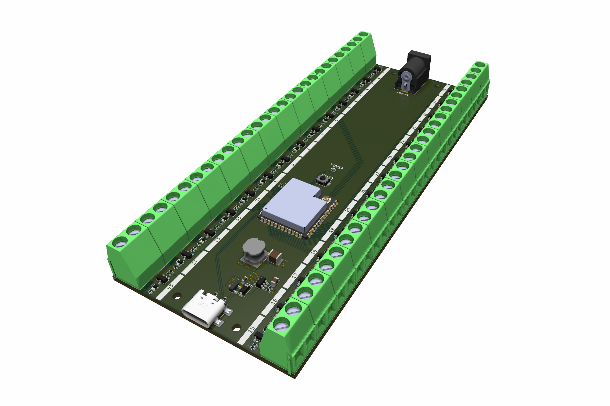
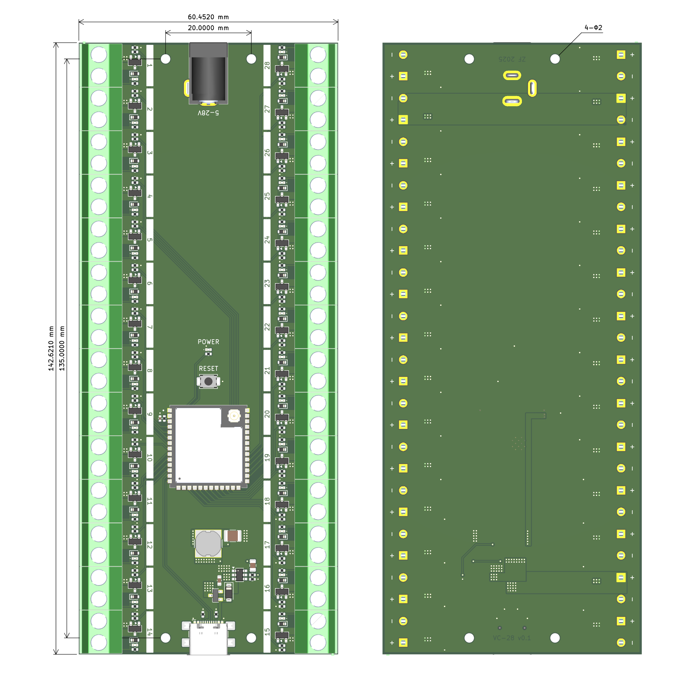

# VC-28 Control Board



The VC-28 Control Board is a 28-channel control module built around the ESP32-S3 microcontroller. It is designed for reliable high-current switching applications, such as controlling pumps and solenoid valves in pneumatic systems.

This repository provides the hardware definitions for the VC-28 Control Board.

## Hardware



### Core

* **Microcontroller:** ESP32-S3-WROOM-1U
* **Memory:** 16 MB Flash / 8 MB PSRAM
* **Reset Control:** On-board tactile reset button
* **USB Interface:** USB Type-C for programming and debugging

### Power

* **Power Input:** 5.5 mm × 2.1 mm barrel jack (supports 5 V – 28 V DC)
* **Maximum Load:** 3 A per channel, 7 A total
* **Power Behavior:** When the barrel jack is connected, it powers both the outputs and the microcontroller. When disconnected, USB supplies the microcontroller only.
* **Power LED:** Red indicator, lit when power is supplied via either barrel jack or USB

### Outputs

* **Channels:** 28, active-high logic
* **Connection Type:** Screw terminals (channel indices labeled on back; polarity markings printed on the underside of the PCB)
* **Indicator LEDs:** One per channel, displaying on/off status

## Compatibility

The VC-28 library is compatible with:

* **Arduino**
* **ESP-IDF**
* **PlatformIO**
* Other **C++** environments supporting the ESP32-S3

## Usage (Arduino)

### Installation

#### 1. Install the ESP32-S3 Board

1. In the Arduino IDE, navigate to **File → Preferences**.
2. In the **Additional Boards Manager URLs** field, add:

   ```
   https://espressif.github.io/arduino-esp32/package_esp32_index.json
   ```
3. Go to **Tools → Board → Boards Manager…**
4. Search for **ESP32** and install the package by *Espressif Systems*.

#### 2. Install the VC-28 Library

1. Download this repository as a `.zip` file.
2. In the Arduino IDE, navigate to:
   **Sketch → Include Library → Add .ZIP Library…**
3. Select the downloaded `.zip` file to install the VC-28 library.

### Programming

Include the board configuration in your sketch:

```cpp
#include "board_config.h"
```

Access any of the 28 output channels using:

```cpp
board.channel(channel_index);
```

More examples are available in the [`examples`](https://github.com/compliant-robotics-and-engineering-lab/vc-28/tree/main/examples) directory.